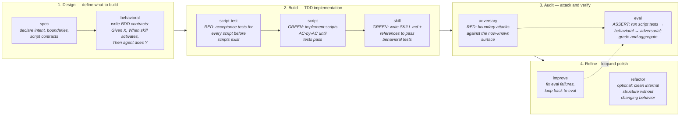

# skills-engineering-skill

A skill (and supporting research) for **engineering Agent Skills** using a rigorous TDD lifecycle. Built on the SKILL.md protocol so the resulting skills can be loaded by any compatible agent harness.

## What's in this repo

```
skills/skills-engineering/   The skill itself (SKILL.md, scripts, tests, references)
docs/scratchpads/            Design notes on skill engineering patterns
docs/troves/                 Curated research sources
PURPOSE.md                   One-line repo purpose
skills-lock.json             Lockfile for vendored upstream skills
```

## Lifecycle

The nine-phase TDD lifecycle is organized into four groups: **Design**, **Build**, **Audit**, and **Refine**.



### How the groups work together

**Design** — Declare what the skill does and how it behaves. Phases 1–2 don't produce code; they produce a spec and behavioral contracts that serve as the acceptance bar for everything that follows.

**Build** — Red-green TDD for scripts and the SKILL.md body. Write failing tests first (`script-test`), then implement (`script`, `skill`). By the end of this group the skill is fully functional.

**Audit** — Read the concrete skill and craft targeted boundary attacks (`adversary`), then run the full test suite through a subagent evaluator (`eval`). The subagent sees only the skill's surface, not its internals — same view a production harness gets.

**Refine** — Fix any failures uncovered by eval and loop until clean (`improve`). The optional `refactor` phase cleans internal structure without changing behavior — no re-eval needed if behavior is unchanged.

A phase router script emits a single targeted prompt per phase so the LLM never sees cross-phase content — context isolation is treated as an API boundary.

### Use it

```bash
bash skills/skills-engineering/scripts/generate.sh \
  --phase <spec|behavioral|script-test|script|skill|adversary|eval|improve|refactor> \
  --skill-path .agents/skills/<skill-name>
```

Invoke via the Skill tool: `/skills-engineering` (or let the harness auto-trigger from the description). Works with Claude Code, opencode, or any compatible harness.

### Key design principles

- **Every script gets TDD** — scripts are code, same discipline as `.py` or `.sh`.
- **Adversarial tests come after the skill exists** — you can't write effective boundary attacks against a skill you haven't read.
- **The context window is the API** — phase isolation prevents authoring leakage into eval and vice versa.
- **Description is the trigger** — the YAML `description` field is the primary discovery mechanism.

## License

MIT (see `skills/skills-engineering/SKILL.md` frontmatter).
